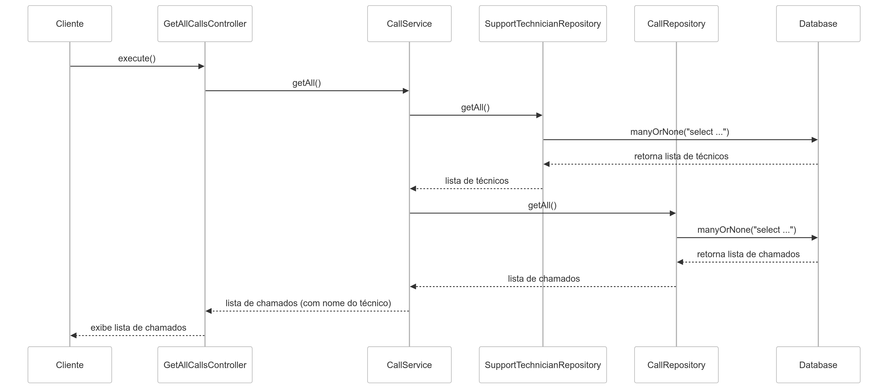

# es-call
Gerenciamento de chamados

## Descrição e Objetivo

Projeto visa resolver o problema do gerenciamento de chamados. Este problema ocorre quando se perde o fluxo dos chamados abertos pelos clientes, a ordem em que foram abertos não é respeitada, não tem priorização, ..., basicamente deixando o gestor sem visão do que está ocorrendo com os chamados e reparos da empresa.

O objetivo é facilitar o gerenciamento desses chamados, dando mais visibilidade para o gestor, permitindo-o visualizar quantos chamados foram abertos, quantos estão em aberto/atendimento/concluído, direcionar um chamado para um atendente/técnico, dentre outras ações de administração de chamados.

## Equipe
<ul>
  <li>Vinicius Trindade Dias Abel (Fullstack)</li>
  <li>Gustavo Ferreira Dias (Frontend)</li>
  <li>Lucas Campos (Backend)</li>
</ul>

## Tecnologias
<ul>
  <li>JavaScript/TypeScript</li>
  <li>Node</li>
  <li>PostgreSql</li>
  <li>Docker</li>
</ul>

## Backlog do Produto
<ul>
  <li>1 - Como gestor, quero visualizar uma lista de chamados em aberto para acompanhar o status de cada um.</li>
  <li>2 - Como gestor, quero atribuir um técnico a um chamado.</li>
  <li>3 - Como gestor, quero priorizar chamados com base em sua importância, para que eles sejam resolvidos primeiro.</li>
  <li>4 - Como gestor, quero realocar chamados de um técnico para outro, caso o técnico esteja indisponível.</li>
  <li>5 - Como gestor, quero gerar relatórios semanais sobre a quantidade de chamados abertos, fechados e em andamento, para acompanhar a performance da equipe.</li>
  <li>6 - Como gestor, quero poder cancelar um chamado que não precisa mais de atendimento.</li>
  <li>7 - Como gestor, quero saber do feedback do cliente sobre o atendimento e solução do técnico.</li>
  <li>8 - Como gestor, quero visualizar o histórico completo de interações em cada chamado, para entender o progresso e possíveis problemas.</li>
  <li>9 - Como gestor, quero ser notificado sobre chamados de alta prioridade ou que estejam próximos do prazo, para agir de maneira proativa.</li>
  <li>10 - Como técnico, quero ser notificado quando um chamado for atribuído a mim.</li>
  <li>11 - Como técnico, quero poder pausar um chamado quando estiver aguardando informações do cliente ou alguma outra necessidade, para que o gestor saiba o andamento do chamado e as demandas dele.</li>
  <li>12 - Como técnico, quero visualizar todos os chamados atribuídos a mim, para que eu possa gerenciar meu fluxo de trabalho.</li>
  <li>13 - Como técnico, quero marcar um chamado como "concluído", para que o gestor e o cliente sejam notificados.</li>
  <li>14 - Como cliente, quero poder abrir chamados, especificando minhas necessidades.</li>
  <li>15 - Como cliente, quero abrir chamados com anexos (imagens ou documentos), para fornecer mais informações ao técnico. </li>
  <li>16 - Como cliente, quero receber atualizações sobre o status do meu chamado, para que eu saiba quando ele está sendo resolvido.</li>
  <li>17 - Como cliente, quero poder reabrir um chamado concluído se o problema persistir, para que o atendimento continue sem que eu tenha que abrir um novo chamado.</li>
  <li>18 - Como cliente, quero poder adicionar comentários em um chamado aberto, para fornecer atualizações adicionais.</li>

</ul> 

## Backlog do Sprint
<ul>
  <li>História 1: Como gestor, quero visualizar uma lista de chamados em aberto para acompanhar o status de cada um.</li>
    

    
Criar o container do aplicativo no Docker.

    
Instalar banco de dados para armazenar chamadas e dados de usuários.

    
Instalar node.js.

    
Fazer código backend que preencha e atualize tabelas do banco de dados com as entradas dos usuários.

    
Implementar a interface visual de preenchimento de dados e visualização de chamados.

    
Exibir status de cada chamado.

  
  <li>História 2: Como gestor, quero atribuir um técnico a um chamado.</li>
    

    
Criar endpoint para atribuição de técnicos aos chamados.

    
Atualizar banco de dados para associar chamados aos IDs de técnicos.

    
Criar interface para que o gestor escolha o técnico a ser atribuído.

    
Implementar mecanismo de notificação para o técnico atribuído.

  <li>História 3: Como gestor, quero priorizar chamados com base em sua importância, para que eles sejam resolvidos primeiro.</li>
    

    
Adicionar campo de prioridade aos chamados no banco de dados.

    
Implementar lógica de ordenação de chamados por prioridade na interface de visualização do gestor.

    
Criar interface para que o gestor possa definir ou alterar a prioridade de cada chamado.

  <li>História 4: Como gestor, quero realocar chamados de um técnico para outro, caso o técnico esteja indisponível.</li>
    

    
Implementar funcionalidade para alterar o técnico responsável por um chamado.

    
Atualizar o backend para lidar com a realocação de chamados no banco de dados.

    
Adicionar notificação para o novo técnico atribuído e aviso ao técnico anterior.

  <li>História 15: Como cliente, quero abrir chamados com anexos (imagens ou documentos), para fornecer mais informações ao técnico.</li>
    

    
Criar funcionalidade para upload de arquivos no formulário de abertura de chamados.

    
Integrar o backend com um sistema de armazenamento de arquivos.

    
Implementar visualização dos anexos na interface do técnico.

  
</ul>

## Diagrama de Atividade

## Diagrama de Sequência

